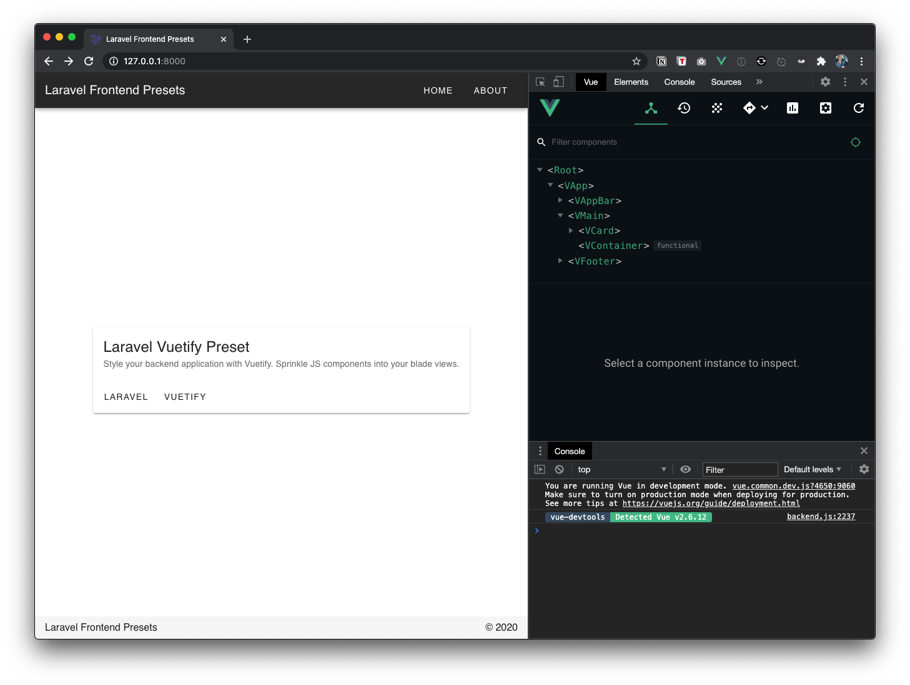

## About Vuetify Laravel Preset



- View based templates.
- Big bundle size. For a full, optimized, Vuetify build, refer to [Vuetify install](https://vuetifyjs.com/en/getting-started/installation/) with Vue-Cli

Caveat(s):
- Do not use short self-closing component syntax eg: `<component />`, use complete `<component></component>`.
- Every time DOM loads, there's a refresh. To avoid this, `router-view` can be used. Keeping as it is, for simplicity's sake. 

Includes:
```
Polyfill
Vue
Vuetify
Axios
Versioning
```

Indecision to put:
- Vuex ?
- Vue-router ?

### Installation
```
git clone git@github.com:ijpatricio/laravel-vuetify-preset.git
composer install
cp .env.example .env
php artisan key:generate
# optional (pre bundled in public folder)
npm install
npm run dev
# npm run watch
# npm run production

```
